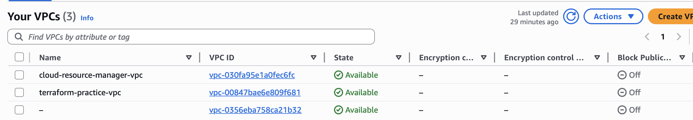
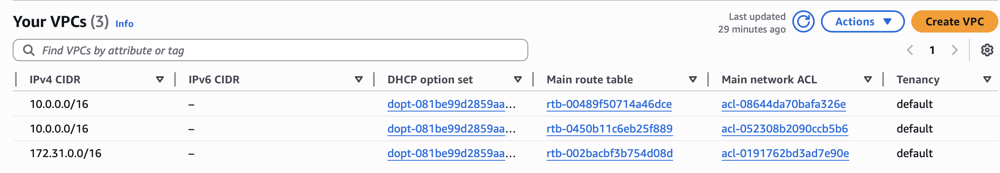
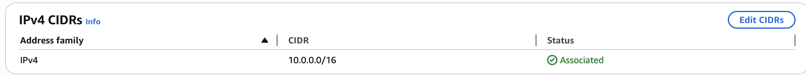
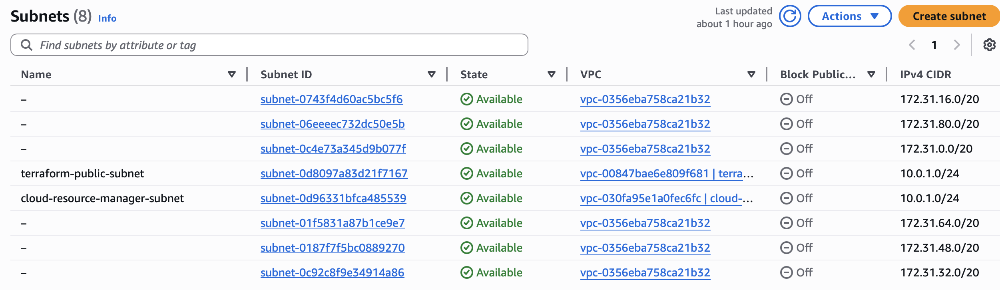
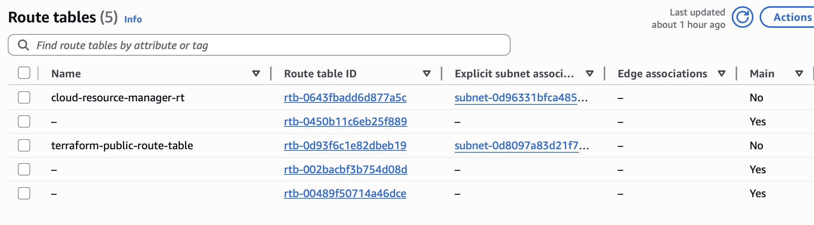
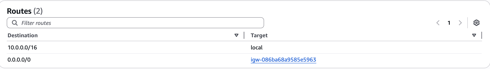
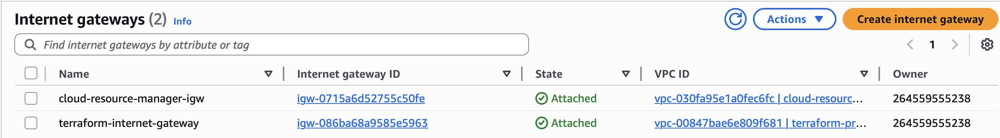

# Terraform Infrastructure Automation

🔗 Live App: (Previously deployed — see infrastructure screenshots below)

Provisioned a complete AWS environment using Terraform, including VPC networking, routing, security groups, and EC2 compute, and deployed a publicly accessible web server.

---

## Overview

This project demonstrates Infrastructure as Code (IaC) by automating the creation of a complete AWS environment using Terraform.

The system provisions a fully functional cloud architecture and deploys a web server accessible from the internet.

---

## Architecture

Internet
↓
Internet Gateway
↓
Route Table (0.0.0.0/0 → IGW)
↓
Public Subnet
↓
EC2 Instance (Apache Web Server)

---

## Infrastructure Screenshots

These screenshots show the live AWS infrastructure provisioned using Terraform.

### VPC Overview



### VPC Configuration



### VPC CIDR Block



### Subnet Configuration



### Route Table Overview



### Routing Rules



### Internet Gateway



---

## ⚙️ Tech Stack

* Terraform
* AWS (VPC, EC2, Networking)
* Amazon Linux 2
* Apache (httpd)

---

## Features

* Automated VPC creation with DNS support
* Public subnet with internet access
* Internet Gateway and routing configuration
* Security group with SSH (22) and HTTP (80) access
* EC2 instance deployment using Terraform
* Web server installation and configuration
* Terraform outputs for public IP and DNS
* Fully reproducible infrastructure using Terraform

---

## Outputs

After running `terraform apply`, Terraform provides:

* EC2 Public IP
* EC2 Public DNS

### Example:

```
ec2_public_ip  = "44.199.208.243"
ec2_public_dns = "ec2-44-199-208-243.compute-1.amazonaws.com"
```

---

## 🌐 Accessing the Application

### 1. SSH into the instance

```bash
ssh -i ~/.ssh/ec2-practice-key.pem ec2-user@<EC2_PUBLIC_IP>
```

### 2. Open in browser

```
http://<EC2_PUBLIC_IP>
```

### Expected Output

```
Hello from Zonique Terraform project
```

---

## 📂 Project Structure

```
terraform-infrastructure-automation/
│
├── main.tf
├── outputs.tf
├── .gitignore
├── README.md
└── screenshots/
```

---

## Key Concepts Demonstrated

* Infrastructure as Code (IaC)
* Terraform state management
* Resource dependencies
* AWS networking (VPC, subnets, routing)
* Security group configuration
* EC2 provisioning and access
* Output variables for automation

---

## Project Goal

This project demonstrates building and managing cloud infrastructure using Terraform, transitioning from manual AWS configuration to scalable, repeatable infrastructure deployment.

---

## Future Improvements

* Add variables (`variables.tf`) for reusable configuration
* Use Terraform modules for better structure
* Add `user_data` to automate web server setup
* Deploy a multi-tier architecture (ALB + multiple EC2s)


